<!-- 
what are you looking for? that's weird... uwu ✨
-->

  
  
  ## ✦ Making things feel alive
  
  A little chaotic, a little かわいい 🐰✨  
  systems underneath, always intentional
  

## 🧃 About this space

I build systems, but not the usual kind ✦  
a mix of code, design, and weird ideas that somehow work

Some are clean. Some are chaotic.  
All of them are intentional (たぶん)

I don't follow trends ✨  
I experiment, break things, and rebuild them better

Everything here is part of something bigger  
even if it doesn't look like it yet

## 🧠 Systems I Use ✦

Not decorative. Not random.  
Just tools that earned their place かわいい✨

  

✦ What's in the stack and why

 

**Rust** — for when correctness isn't optional  
**TypeScript** — because untyped JS doesn't survive a system  
**Flutter** — one codebase, real targets  
**PHP** — it's still here. it still works. respect.  
**C#** — when the runtime demands it  
**Bun** — fast by default, no negotiation  
**Deno** — TypeScript without the setup tax  
**Supabase** — infrastructure that stays out of the way  
**PostgreSQL** — the one that never disappoints

The stack adapts to the idea.  
Not the other way around.

Some tools stayed.  
Some didn't survive.

Everything evolves — that's part of the system.

## 🧩 What Never Changes ✦

Clean structure.  
Clear hierarchy.  
Systems that go deep.

Design that feels intentional 🐰✨  
Not assembled. Not random.

Some things get rebuilt.  
Some get replaced.

But the core always stays.

## ✦ Active Systems

| Project | Branch | What it does |
|---|---|---|
| [PsychoQuine](https://github.com/Sxnnyside-Project/Psychoquine) | SP | Universal Quine generator — any text, self-replicating |
| [orph-cli](https://github.com/CoreRed-Project/orph-cli) | CoreRed | Offline-first CLI harness for Raspberry Pi |
| [Pollux · Native Bridge](https://github.com/HoujouSxnnyside/Pollux-Polyglot-Native-Bridge) | Pollux | Sovereign boundary between Pollux and external ecosystems |

---

## ✦ Philosophy

> Software should feel authored かわいい✨  
> Not assembled. Not stitched.  
> **Authored.**

## 📊 Activity ✦

  
  

## 🟣 Support the chaos ✦

  A small way to keep these strange systems alive 🧃✨

---

  
    Built with structure. Dressed in chaos ✦
  

